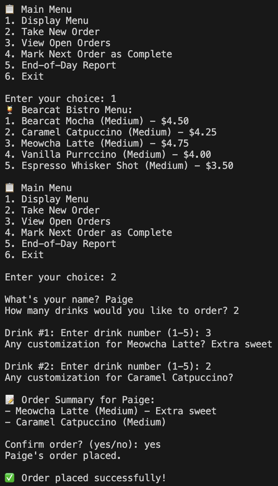
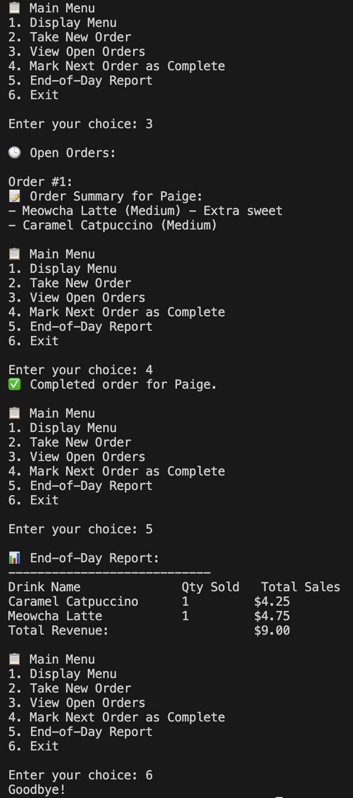

Data structure choices for each component:

    1. Menu: Array
        - Justification:
            Our menu is fixed and it is nice to access items by index.
        - Complexity Analysis:
            Index-based access is O(1)
        - Trade-offs:
            Arrays are not as efficient for insertions or deletions, but in this case our menu stays the same. 

    2. Customer Order: list
        - Justification:
            Each customer's order is a list of drink items. Multiple drinks can be stored in the list
        - Complexity Analysis:
            Append drink to order: O(1)
            Iterate through items for printing or billing: O(n)
        - Trade-offs:
            Lists are not ideal for searching by key, but that is ok for the way we are using customer orders here.

    3. Open Orders Queue: CircularQueue
        - Justification:
            Orders are processed in the order in which they are recieved, which is how queues behave (First-In-First-Out). Using this data structure, we reuse memory efficiently.    
        - Complexity Analysis:
            Enqueue (add order): O(1)
            Dequeue (complete order): O(1)
        - Trade-offs:
            I had to set a fixed capacity, but you can change the maximum number so that it will be unlikley to be exceeded in a single day.

    4. Completed Orders: Bag
        - Justification:
            Completed orders do not need to by accessed by key or position. They are just stored in general. 
        - Complexity Analysis:
            Adding completed orders: O(1)
            Iteration through orders: O(n)
        - Trade-offs:
            You can't directly look up an order that has been completed, but that is ok because it isn't necessary for this kind of record-keeping. 

    5. Sales Summary: HashMap
        - Justification:
            By using the drink name as the key, we can track the amounts of each drink that were sold as well as the total sales from each drink.
        - Complexity Analysis:
            Set: O(1)
            Get: O(1)
            Iterate all items: O(n)
        - Trade-offs:
            This doesn't keep track of individual orders by customer name, only the total amount of drinks sold and money earned. However, this is sufficient for end-of-day reports.

Instructions to run the program:
    Navigate to program.py. On my system, I have to try to run it, then enter this into the terminal: 

    export PYTHONPATH=/Users/pkmckenna/Documents/GitHub cs152-repository-pmkunz:$PYTHONPATH

    and then it will work when I try to run it again. This sets the Python path correctly. 

Sample run:
    
    

Any known bugs or limitations:
    - There is no size customization, every drink is hardcoded as "Medium"
    - CircularQueue has a fixed capacity, but that max number can be changed

What I'd add next if I had more time:
    - I would implement size customization with different prices.
    - Cancellation and editing of orders
    - Timestamps for each order
        -This could let you see at what times of the day they earn the most sales

